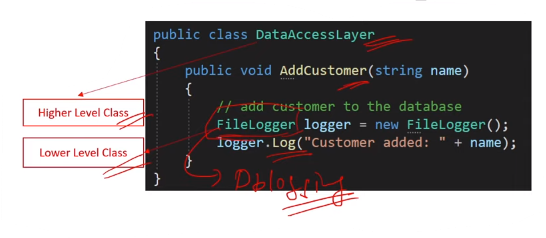
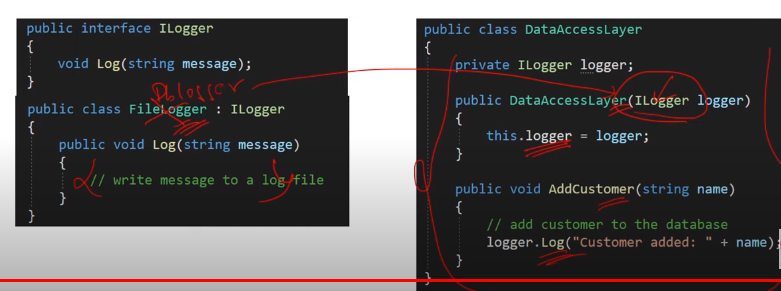

### Q7. What are Dependency Inversion Principle (DIP) ?

- The Dependency Inversion Principle (DIP) states
  that a **high-level class must not depend upon a
  lower level class**.

- Correct way to implement DIP

