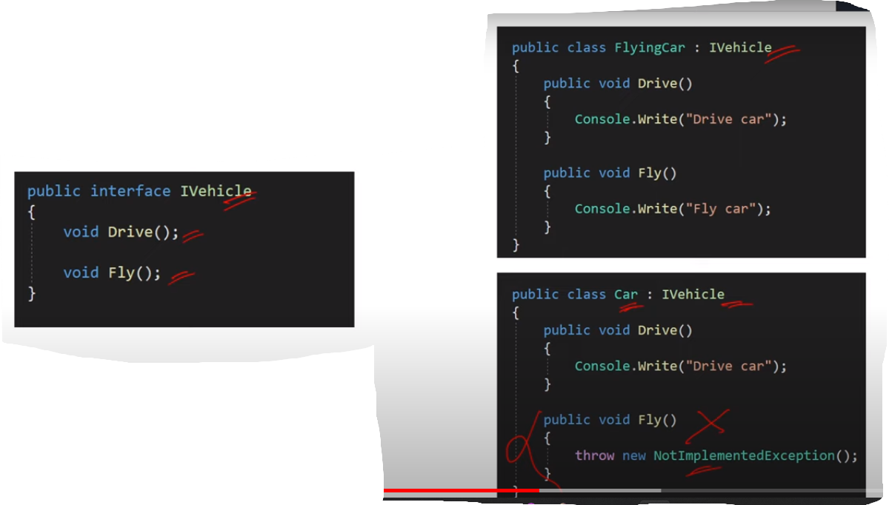
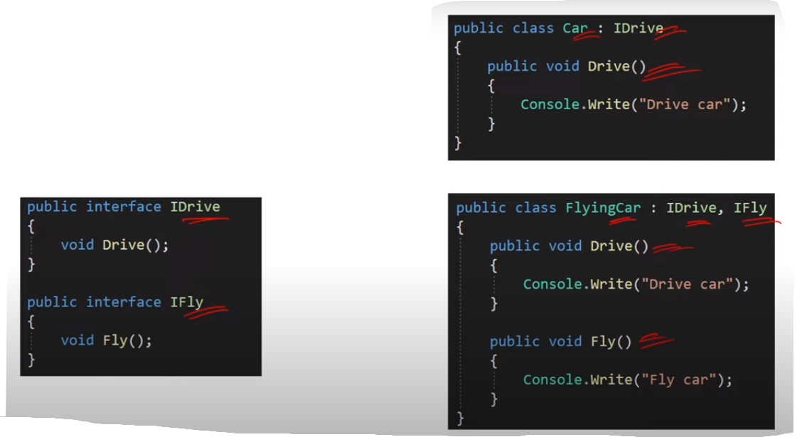

### Q6. What is Interface Segregation (ISP) ?

- The Interface Segregation (ISP) states that a
  class should not be forced to implement
  interfaces that it does not use.

- It is better to have multiple smaller
  interfaces than larger interfaces.

