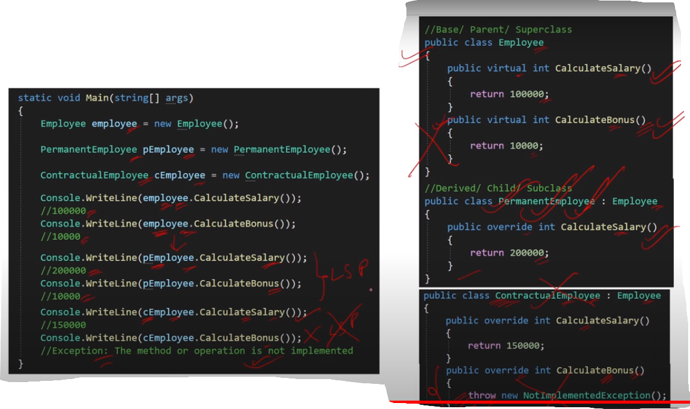

### Q5. What is Liskov Substitution Principle (LSP) ?

- The Liskov Substitution Principle (LSP) states that an
  **object of a child class must be able to replace an object
  of the parent class** without breaking the application.

- All the base class methods must be applicable for the derived class.
