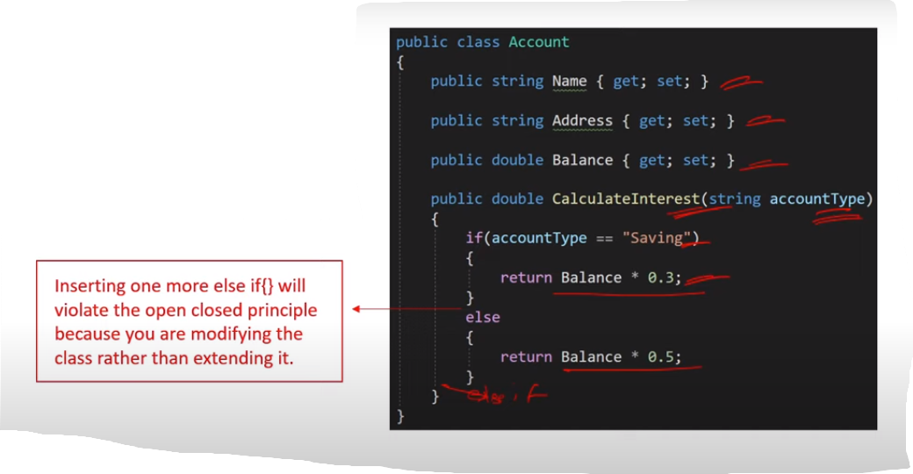
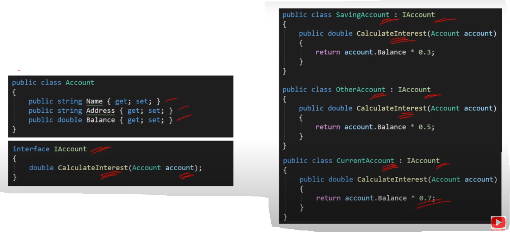

### Q4. What is Open-Closed Principle (OCP) ?

- Open-Closed Principle (OCP) states that software
  entities (classes, modules) should be **open for extension**, but **closed for modification**.

- SRP is the prerequisite for OCP.

- The benefit is simple testing is required to test individual
  classes, but if you will keep on adding and modifying in
  one class. Then even for the smallest modification, the
  whole class needs to be tested.
