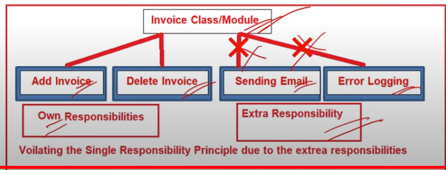

# SOLID Princriple

### Q1. What are Solid principles ?

- SOLID principles are a set of principles,
- Which must be followed to **develop flexible, maintainable and scalable software systems**.

### Q2. What are the types of SOLID principles?

- They are 5 different kinds of SOLID


### Q3. What is Single Responsibility Principle (SRP) ?

- Single Responsibility Principle (SRP) states that a class should have only one responsibility.
- Or a class should have only one reason to change.
- When a class has only one responsibility, it becomes easier
  to change and test. If a class has multiple responsibilities,
  changing one responsibility may impact others and more
  testing efforts will be required then.

```//Violating SRP, because the class.
//has extra responsibility
public class Employee
{
    //Own responsibility
    public int CalculateSalary()
    {
        return 100000;
    }

    //Own responsibility
    public string GetDepartment()
    {
        return "IT";
    }

    //Extra responsibility
    public void Save()
    {
        //Save employee to the database
    }
}
```

- Must Follow the SRP

```
//Following SRP
public class Employee
{
    public int CalculateSalary()
    {
        return 100000;
    }
    public string GetDepartment ()
    {
        return "IT";
    }
}

public class EmployeeRepository
{
    public void Save (Employee employee)
    {
        //Save employee to the database
    }
}
```


