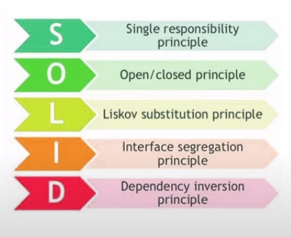

# SOLID Princriple

### Q1. What are Solid principles ?

> SOLID principles are a set of principles,
> which must be followed to **develop flexible, maintainable and scalable software systems**.

### Q2. What are the types of SOLID principles?

- They are 5 different kinds of SOLID

### Q3. What is Single Responsibility Principle (SRP) ?
